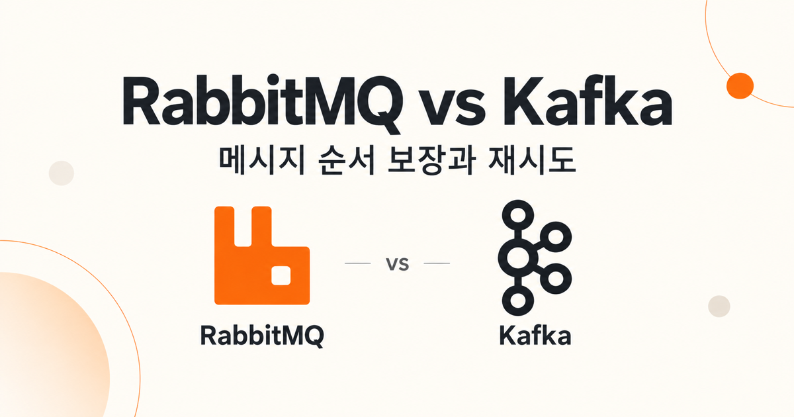
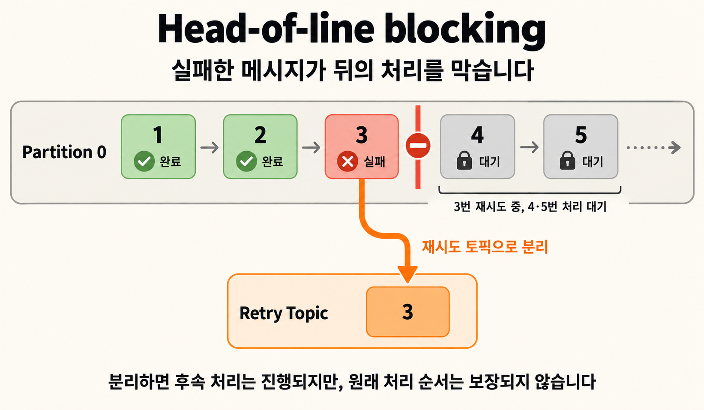
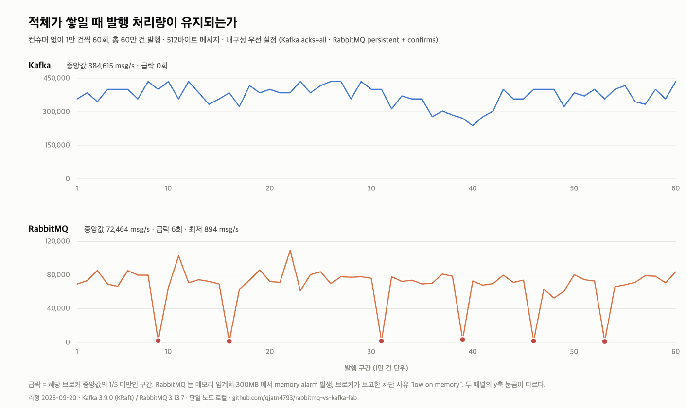
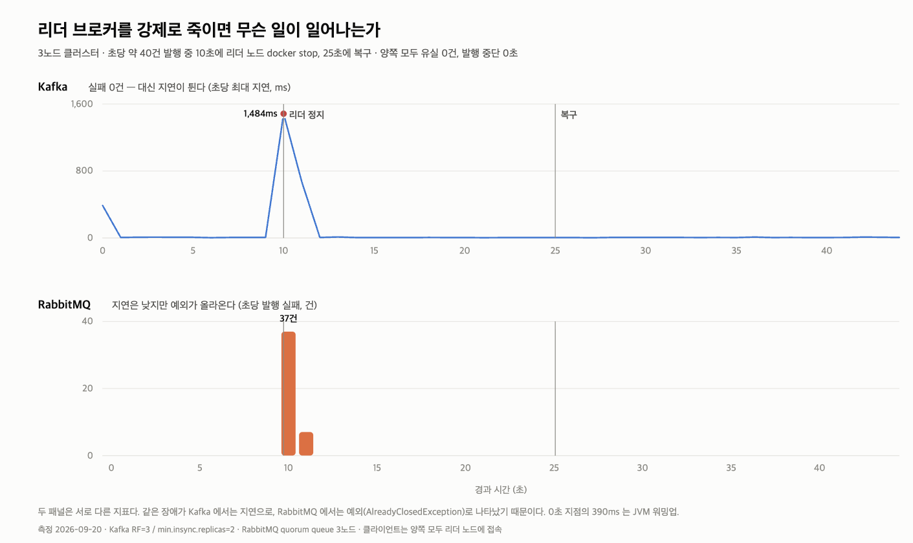

# RabbitMQ와 Kafka, 무엇이 실제로 다른가 — 7가지를 직접 재현해봤다



실험 코드는 전부 [rabbitmq-vs-kafka-lab 저장소](https://github.com/qjatn4793/rabbitmq-vs-kafka-lab)에 있다. 이 글의 모든 숫자는 로컬에서 직접 측정한 값이고, 환경은 맨 아래에 적어뒀다.

RabbitMQ와 Kafka를 비교하는 글은 많다. 그런데 대부분 표 하나로 끝난다. "Kafka는 순서를 보장하고 RabbitMQ는 안 한다", "Kafka가 더 빠르다" 같은 문장이 근거 없이 떠다닌다.

나도 그 문장들을 그대로 외우고 있었다. 그래서 직접 돌려봤다. docker-compose로 두 브로커를 띄우고, 일곱 가지를 재현해서 숫자로 확인했다.

**그 과정에서 내가 알고 있던 것 중 네 가지가 틀렸다.** 그게 이 글에서 제일 쓸모 있는 부분이다.

---

## 0. 축: 우열이 아니라 설계 철학이 반대다

먼저 결론의 뼈대부터.

> **RabbitMQ = 똑똑한 브로커 + 단순한 컨슈머**
> 라우팅, 우선순위, 지연, dead letter를 브로커가 처리한다. 컨슈머는 받아서 처리만 하면 된다.
>
> **Kafka = 단순한 브로커 + 똑똑한 컨슈머**
> 브로커는 로그에 append만 한다. 어디까지 읽었는지도, 실패하면 어떻게 할지도 컨슈머 책임이다.

아래 모든 차이가 이 한 줄에서 파생된다.

---

## 1. 소비한 메시지를 다시 읽을 수 있는가

가장 근본적인 차이다. RabbitMQ는 **큐**고 Kafka는 **로그**다.

- RabbitMQ: 컨슈머가 ack를 보내면 그 메시지는 큐에서 사라진다. (파괴적 읽기)
- Kafka: 소비해도 로그에 그대로 남는다. 컨슈머 그룹별로 "어디까지 읽었는지"(오프셋)만 따로 기록한다.

메시지 10건을 넣고, 한 번 소비한 뒤 다시 읽어봤다.

```
── Kafka
produce 완료 : msg-1 ~ msg-10
1차 consume  : 10건, offset [0, 1, 2, 3, 4, 5, 6, 7, 8, 9]
offset commit: 완료
그대로 재-poll: 0건  (읽은 지점 뒤에는 남은 게 없음)
seekToBeginning 후 consume: 10건 → [msg-1, ... msg-10]

── RabbitMQ
1차 consume  : 10건 (수신과 동시에 ack)
큐에 남은 수  : 0건
재-consume 시도: 없음 → ack 된 메시지는 큐에서 사라져 되돌릴 수 없다
```

Kafka는 `seekToBeginning()` 한 줄로 10건을 통째로 다시 처리했다. 장애가 나서 "어제 3시부터 다시 처리해야 한다"가 가능한 이유가 이것이다.

**다만 무한하지 않다.** `retention.ms` 기본값이 7일이라, 열흘 전 장애는 되감을 수 없다. "Kafka는 재처리가 된다"에는 항상 **"보존 기간 안에서"**가 붙어야 한다.

**덧붙임.** RabbitMQ 3.9부터 **Streams**가 들어왔다. 로그 기반이고 오프셋으로 읽으며 소비해도 지워지지 않는다. "RabbitMQ = 큐"는 이제 반쪽만 맞는 말이다.

---

## 2. 컨슈머를 여러 개 붙이면 순서가 깨진다

큐는 FIFO로 **전달**한다. 하지만 처리 시간이 제각각이면 **완료 순서**는 발행 순서와 달라진다. 메시지 1–30번을 순서대로 발행하고, 각 처리에 10–60ms의 난수 지연을 준 뒤 완료 순서를 기록했다.

**컨슈머 3개 (경쟁 컨슈머)**

```
[2, 3, 1, 4, 5, 8, 6, 9, 7, 12, 10, 11, 15, 14, 13, 16, 17, 19, 18, 21, 22, 20, 23, 24, 25, 28, 26, 27, 29, 30]
인접 역전 9회 → 순서 깨짐
```

**컨슈머 1개**

```
[1, 2, 3, ... 30]
인접 역전 0회 → 순서 유지
```

RabbitMQ에서 순서를 지키려면 1큐 1컨슈머로 가거나 `x-single-active-consumer`를 써야 한다. 즉 **순서와 병렬 처리가 맞바꿈 관계**다. 이게 Kafka와 갈리는 첫 지점이다.

---

## 3. "키 없이 보내면 순서가 깨진다" — 여기서 처음 틀렸다

Kafka의 순서 보장 단위는 토픽이 아니라 **파티션**이다. 여기까지는 맞다.

그래서 나는 이렇게 알고 있었다. **"키 없이 보내면 메시지가 파티션에 흩어져서 순서가 깨진다."** 주문 3건 × 이벤트 4단계 = 12건을 파티션 3개 토픽에 키 없이 보내봤다.

```
order-A : 파티션 [0] 사용 (1개)
order-B : 파티션 [0] 사용 (1개)
order-C : 파티션 [0] 사용 (1개)
파티션 분포 : {0=12}
```

**전부 한 파티션에 들어갔다.** 가설과 정반대다.

범인은 Kafka 2.4부터 기본인 **sticky partitioner**였다. 키가 없으면 라운드로빈으로 뿌리는 게 아니라, **`batch.size`(기본 16KB)만큼 쌓일 때까지 한 파티션에 몰아 보낸다.** 12건 × 200바이트 = 2.4KB로는 배치가 넘어가지 않으니 파티션이 바뀔 이유가 없었다.

레코드를 200바이트로 키우고 600건(약 117KB)을 보내니 그제야 흩어졌다.

```
order-A : 파티션 [0, 1, 2] 사용 (3개)
order-B : 파티션 [0, 1, 2] 사용 (3개)
order-C : 파티션 [0, 1, 2] 사용 (3개)
파티션 분포 : {0=204, 1=254, 2=142}
```

주문 ID를 키로 주면 모든 발행량에서 주문별로 파티션이 하나씩 고정됐다.

**결론이 바뀌었다.** 키 없이 순서가 지켜지는 건 **보장이 아니라 우연**이다. 개발 환경의 적은 트래픽에서는 멀쩡하다가, 운영에서 트래픽이 늘면 **조용히 깨진다.** 이런 버그가 제일 무섭다.

한 가지 더. **키를 줘도 나중에 파티션 수를 늘리면** 키→파티션 매핑이 바뀌어 그 시점 전후로 같은 키가 다른 파티션에 갈라진다. 파티션 증설은 순서 보장을 무너뜨린다.

---

## 4. 실패 한 건이 뒤를 막는가 — 실무에서 제일 크게 체감되는 차이

1번부터 10번까지 보내고, **4번에서만 항상 예외를 던지게** 했다.

**Kafka** (파티션 1개, 오프셋을 커밋하지 않고 되감아 재시도)

```
처리 성공 : [1, 2, 3]
4번 재시도 : 10회 (5000ms 동안, 200ms 백오프)
끝내 처리 못한 메시지 : [5, 6, 7, 8, 9, 10]
```

**RabbitMQ** (실패 시 `AmqpRejectAndDontRequeueException` → DLQ)

```
처리 성공 : [1, 2, 3, 5, 6, 7, 8, 9, 10]
DLQ 로 보낸 메시지 : 1건 (seq=4)
```

같은 "실패 1건"인데 결과가 완전히 다르다. Kafka는 파티션당 오프셋이 **하나뿐**이다. 4번을 넘기지 못하면 5번 이후로 갈 방법이 없다. 이게 **head-of-line blocking**이다. 컨슈머 로그에는 같은 메시지 처리 실패만 반복해서 찍히고, 그 사이 컨슈머 랙은 계속 쌓인다.



RabbitMQ는 메시지 단위로 ack/nack하므로 실패한 한 건만 DLQ로 빠지고 나머지는 그대로 흘러간다.

**실무 대응.** Kafka에서는 파티션을 막지 않는 재시도가 필요하다. Spring Kafka의 `@RetryableTopic`을 쓰면 실패 메시지를 재시도 전용 토픽 체인으로 넘기고 최종적으로 DLT(Dead Letter Topic)로 보낸다. 즉 **RabbitMQ가 브로커에서 해주는 걸 Kafka는 직접 구성해야 한다.**

---

## 5. 처리량 — "Kafka가 빠르다"는 조건을 빼면 의미 없다

내구성 수준을 맞춰서 쟀다. 512바이트 메시지 10만 건(약 48MB).

<table border="1" cellpadding="8" cellspacing="0">
  <thead><tr><th>구분</th><th>소요</th><th>처리량</th><th>대역폭</th></tr></thead>
  <tbody>
    <tr><td>Kafka 발행 (acks=all + 멱등)</td><td>557 ms</td><td><strong>179,533 msg/s</strong></td><td>87.7 MB/s</td></tr>
    <tr><td>Kafka 소비</td><td>283 ms</td><td>353,357 msg/s</td><td>172.5 MB/s</td></tr>
    <tr><td>Kafka 발행 (acks=1)</td><td>417 ms</td><td>239,808 msg/s</td><td>117.1 MB/s</td></tr>
    <tr><td>RabbitMQ 발행 (persistent + confirms)</td><td>1,416 ms</td><td><strong>70,621 msg/s</strong></td><td>34.5 MB/s</td></tr>
    <tr><td>RabbitMQ 소비</td><td>1,088 ms</td><td>91,912 msg/s</td><td>44.9 MB/s</td></tr>
    <tr><td>RabbitMQ 발행 (transient, confirms 없음)</td><td>876 ms</td><td>114,155 msg/s</td><td>55.7 MB/s</td></tr>
  </tbody>
</table>

같은 내구성 조건에서 발행 처리량은 **Kafka가 약 2.5배**였다.

빠른 이유는 마법이 아니라 구조다.

- 메시지를 건건이 다루지 않고 **배치로 묶어 파일에 순차 append**한다
- **라우팅 판단이 없다.** 어느 파티션에 붙일지만 정하면 끝

RabbitMQ는 메시지마다 exchange를 거쳐 라우팅하고 상태를 관리한다. 그 비용을 치르는 대신 **topic/헤더 기반의 유연한 라우팅, 우선순위, 지연 큐**를 얻는다.

단일 노드 로컬 기준이다. replication factor 3을 켜면 Kafka 수치도 내려간다. 절대값이 아니라 **비율과 이유**를 보는 게 맞다.

---

## 6. 진짜 차이는 여기 있었다 — 적체가 쌓일 때

처리량 절대값보다 이쪽이 "대용량 트래픽을 누가 더 잘 견디는가"에 가깝다. **컨슈머를 붙이지 않고** 1만 건씩 60번, 총 60만 건을 계속 발행하면서 구간별 처리량을 쟀다.

먼저 기본 설정에서. **결과는 놀랍게도 무승부였다.** 20만 건(97MB)까지 Kafka도 RabbitMQ도 처리량이 평탄했다. RabbitMQ의 메모리 임계치가 기본값(가용 메모리의 40% = 이 환경에서 3.1GB)이라 근처도 못 갔기 때문이다.

**여기서 두 번째로 틀렸다.** "RabbitMQ는 쌓이면 느려진다"는 통념은 적어도 임계치 안에서는 관측되지 않았다.

그래서 임계치를 300MB로 낮춰 같은 메커니즘을 작은 규모에서 재현했다.

```
Kafka
구간별 중앙값 384,615 msg/s, 급락 구간 0개

RabbitMQ
구간별 중앙값 72,464 msg/s, 급락 구간 6개
  #9(1,938) #16(1,233) #31(1,615) #39(3,188) #46(1,621) #53(894 msg/s)

종료 시점 : 메모리 303MB 사용 / 임계치 300MB, memory alarm=true
브로커가 알려준 차단 사유: low on memory
```



**느려진 게 아니라 멈췄다 풀렸다를 반복한다.** 평소 72,000 msg/s로 흐르다가 주기적으로 **894–3,188 msg/s**까지 떨어진다. 중앙값의 1–4% 수준이다.

임계치를 128MB까지 더 낮췄더니 더 명확해졌다.

```
Alarms:      Memory alarm on node rabbit@...
Connection:  ... -> ...:5672   state = blocked
```

RabbitMQ는 메모리 임계치를 넘으면 **발행자 연결을 차단해서** 스스로를 보호한다. 이때는 `basicPublish` 호출 자체가 무한 대기에 빠진다. publisher confirm 타임아웃으로도 안 잡혀서 `BlockedListener`로 감지해야 했다.

### 이게 무슨 뜻인가

- **Kafka는 적체가 정상 상태다.** 메시지는 원래 디스크 로그에 남는 것이고, 컨슈머 진행 위치는 오프셋 숫자 하나로만 관리된다. 쌓여도 발행 속도가 흔들릴 이유가 없다.
- **RabbitMQ는 적체가 이상 신호다.** 큐는 비워지는 걸 전제로 만들어졌다. 한계를 넘으면 발행 측을 막아서 자기를 지킨다.

실무로 옮기면 이렇다. **컨슈머가 장애로 몇 시간 죽어 있을 때,**

<table border="1" cellpadding="8" cellspacing="0">
  <thead><tr><th>브로커</th><th>발행 측 영향</th></tr></thead>
  <tbody>
    <tr><td>Kafka</td><td>없음. 컨슈머만 복구해서 밀린 만큼 따라잡으면 된다</td></tr>
    <tr><td>RabbitMQ</td><td>임계치를 넘으면 발행 측까지 멈춰 <strong>장애가 상류로 번진다</strong></td></tr>
  </tbody>
</table>

이것이 대용량 비동기 파이프라인에 Kafka를 고르는 실질적인 이유다. "Kafka가 빠르니까"가 아니라 **"한계를 넘었을 때 무너지는 방식이 다르니까"** 다. 평균 처리량만 보면 이 현상은 묻힌다. **p99는 여기서 폭발한다.**

---

## 7. 고가용성 — 브로커를 죽여봤다

3노드 클러스터를 따로 띄웠다.

- Kafka: `replication.factor=3`, `min.insync.replicas=2`, `acks=all`
- RabbitMQ: `x-queue-type=quorum`(Raft 기반 3노드 복제) + persistent + confirms

초당 40건쯤 발행하는 도중 **리더 노드를 `docker stop`** 하고, 15초 뒤 되살렸다.

**조건을 맞추는 게 중요했다.** Kafka 프로듀서는 구조상 항상 파티션 리더와 직접 통신한다. 리더를 죽이면 클라이언트의 TCP 연결이 반드시 끊긴다. 반면 RabbitMQ는 아무 노드에나 붙을 수 있어서, 처음엔 리더가 아닌 노드에 붙어 있었고 연결이 살아 있는 채로 내부 리더만 바뀌어 훨씬 유리한 조건이 되어 있었다. 그래서 **클라이언트가 quorum queue 리더 노드에 붙도록 강제**한 뒤 다시 쟀다.

<table border="1" cellpadding="8" cellspacing="0">
  <thead><tr><th>구분</th><th>Kafka</th><th>RabbitMQ (quorum)</th></tr></thead>
  <tbody>
    <tr><td>리더 전환</td><td>3 → 1</td><td>rabbit3 → rabbit2</td></tr>
    <tr><td><strong>발행 중단</strong></td><td><strong>0초</strong></td><td><strong>0초</strong></td></tr>
    <tr><td><strong>발행 실패</strong></td><td><strong>0건</strong> / 1,918건</td><td><strong>44건</strong> / 1,728건</td></tr>
    <tr><td><strong>ack 후 유실</strong></td><td><strong>0건</strong></td><td><strong>0건</strong></td></tr>
    <tr><td>장애 순간 최대 지연</td><td><strong>1,484ms</strong></td><td>6ms</td></tr>
    <tr><td>앱이 받은 예외</td><td>없음</td><td><code>AlreadyClosedException</code> 44건</td></tr>
  </tbody>
</table>

```
Kafka                                RabbitMQ
 8s  ack=43  maxLatency=   7ms        8s  ack=37 실패= 0  maxLatency= 6ms
 9s  ack=42  maxLatency=   7ms        9s  ack=39 실패= 0  maxLatency= 5ms
10s  ack=43  maxLatency=1484ms ←죽임 10s  ack= 5 실패=37  maxLatency= 6ms ←죽임
11s  ack=46  maxLatency= 673ms       11s  ack=32 실패= 7  maxLatency= 6ms
12s  ack=42  maxLatency=   7ms       12s  ack=39 실패= 0  maxLatency= 7ms
```



### 세 번째로 틀렸던 것

**"RabbitMQ는 고가용성이 약하다"는 통념은 quorum queue 기준으로 맞지 않는다.** Raft 복제라 과반만 살아 있으면 즉시 새 리더를 뽑고, **유실은 0건**이었다. 통념은 4.0에서 제거된 옛날 mirrored queue 시절 이야기다.

### 대신 진짜 차이는 "실패가 어디서 처리되는가"였다

- **Kafka** — 실패 0건. 대신 그 순간 **지연이 1.5초로 튀었다.** 리더 감지·메타데이터 갱신·재시도가 전부 프로듀서 라이브러리 안에서 끝난다. 애플리케이션 입장에서는 **"잠깐 느려졌다"** 로만 보인다.
- **RabbitMQ** — 지연은 한 자리 ms를 유지했지만 **`AlreadyClosedException`이 44건** 올라왔다. 연결은 자동 복구되지만, 끊기는 순간 진행 중이던 발행은 **예외로 애플리케이션에 전달**된다. **재시도 책임이 앱에 있다.**

같은 "무손실"이라도 Kafka는 실패를 라이브러리가 삼키고, RabbitMQ는 앱에게 넘긴다. RabbitMQ로 무손실을 보장하려면 **발행 실패를 잡아 재시도하는 코드를 직접 짜야 한다.**

---

## 8. 중복 처리는 브로커가 해주지 않는다 — 네 번째로 틀렸던 것

나는 "Kafka는 messageId랑 PK로 중복을 막을 수 있다"고 정리하고 있었다. 틀린 건 아니지만 **Kafka의 장점으로 분류한 게 틀렸다.**

중복 방지는 **브로커와 무관한 애플리케이션 책임**이다. RabbitMQ도 똑같이 멱등 키 + 처리 이력 테이블로 막는다. **둘 다 기본이 at-least-once다.** Kafka가 더 가진 건 따로 있고, 범위가 좁다.

- **멱등 프로듀서** (`enable.idempotence=true`, 3.0부터 기본값) → **프로듀서 재시도로 생기는 중복**만 막는다. 컨슈머 중복은 별개다.
- **트랜잭션(EOS)** → **Kafka 안에서의** read-process-write만 exactly-once. **DB 쓰기나 외부 API 호출은 안 덮는다.** 그건 Outbox 패턴이나 멱등 키가 필요하다.

그리고 이 멱등 프로듀서 때문에 실험 중에 발이 묶이기도 했다. 매 실험마다 토픽을 초기화하려고 지웠다 같은 이름으로 다시 만들었더니 이렇게 됐다.

```
Error: NOT_LEADER_OR_FOLLOWER
Error: OUT_OF_ORDER_SEQUENCE_NUMBER (2147483645 attempts left)
```

프로듀서는 토픽-파티션별 시퀀스 번호를 들고 있는데, 토픽이 재생성되면 브로커 쪽만 리셋되어 어긋난다. 그러면 무한 재시도에 빠진다. 결국 실행마다 **새 이름의 토픽**을 쓰도록 바꿨다.

---

## 9. 그래서 언제 무엇을 쓰나

<table border="1" cellpadding="8" cellspacing="0">
  <thead><tr><th>기준</th><th>RabbitMQ</th><th>Kafka</th></tr></thead>
  <tbody>
    <tr><td>잘 맞는 곳</td><td>작업 큐, 복잡한 라우팅, 우선순위/지연, 낮은 지연</td><td>이벤트 소싱, 여러 팀 fan-out, 재처리, 대용량 스트림</td></tr>
    <tr><td>순서</td><td>1큐 1컨슈머 또는 single-active-consumer 필요</td><td>파티션 단위 보장 (키 설계 전제)</td></tr>
    <tr><td>실패 격리</td><td>메시지 단위, DLQ로 자동 격리</td><td>파티션 단위, 재시도 토픽 체인 직접 구성</td></tr>
    <tr><td>적체</td><td>임계치 넘으면 발행자 차단</td><td>정상 상태로 취급</td></tr>
    <tr><td>재처리</td><td>발행 측이 다시 보내야 함 (Streams 제외)</td><td>retention 내 오프셋 되감기</td></tr>
    <tr><td>장애 시 앱이 보는 것</td><td>예외 (직접 재시도)</td><td>지연 (라이브러리가 흡수)</td></tr>
  </tbody>
</table>

**하나의 이벤트를 여러 팀이 각자 독립적으로 소비해야 한다면** Kafka가 맞다. 컨슈머 그룹이 다르면 같은 파티션을 각자 읽을 수 있기 때문이다. (참고로 나는 이 규칙을 반대로 알고 있었다. 정확히는 **같은 그룹 안에서** 한 파티션은 한 컨슈머에게만 할당되고, **다른 그룹끼리는** 같은 파티션을 공유해서 읽는다.)

**메시지마다 다른 조건으로 라우팅해야 하거나, 지연 실행·우선순위가 필요하면** RabbitMQ가 훨씬 편하다. Kafka로 그걸 하려면 애플리케이션에서 다 짜야 한다.

---

## 10. 정리하며 — 공부하면서 틀렸던 네 가지

1. **"키 없이 보내면 파티션에 흩어진다"** → sticky partitioner 때문에 소량에서는 한 파티션에 몰린다. 흩어지는 건 배치가 넘어갈 때부터다. 즉 순서가 지켜지는 건 우연이지 보장이 아니다.
2. **"RabbitMQ는 쌓이면 느려진다"** → 임계치 안에서는 평탄했다. 넘으면 느려지는 게 아니라 **발행자를 차단한다.**
3. **"RabbitMQ는 고가용성이 약하다"** → quorum queue로는 무손실 페일오버가 됐다. 그건 mirrored queue 시절 이야기다.
4. **"중복 방지는 Kafka의 장점"** → 브로커와 무관한 앱 책임이다. Kafka의 EOS는 Kafka 내부로 범위가 한정된다.

덤으로 하나 더. 첫 페일오버 측정에서 **confirm 1,697건 / 큐 1,535건**이 나와 162건이 사라진 줄 알았다. `rabbitmqctl`로 직접 세어보니 **전부 있었다.** 관리 API 통계가 5초 주기로 갱신되기 때문이었다. 대시보드 숫자와 실제 상태는 다를 수 있다. 장애 대응 중이라면 이 차이가 오판을 만든다.

---

## 실험 환경

<table border="1" cellpadding="8" cellspacing="0">
  <thead><tr><th>항목</th><th>값</th></tr></thead>
  <tbody>
    <tr><td>Kafka</td><td>3.9.0 (KRaft) — 실험 1–6 단일 브로커, 실험 7 3브로커 RF=3 / min.insync.replicas=2</td></tr>
    <tr><td>RabbitMQ</td><td>3.13.7 — 실험 1–6 classic queue, 실험 7 quorum queue 3노드</td></tr>
    <tr><td>Java / Spring Boot / Kotlin</td><td>21.0.9 / 3.4.1 / 2.1.0</td></tr>
    <tr><td>OS</td><td>macOS 26.2, 10 cores</td></tr>
  </tbody>
</table>

주요 설정은 다음과 같다.

- Kafka 프로듀서: `acks=all`, `enable.idempotence=true`, `batch.size=16384`(기본값)
- Kafka 컨슈머: `enable.auto.commit=false`, `auto.offset.reset=earliest`
- RabbitMQ: `prefetch=1`, persistent + publisher confirms

단일 노드·로컬 환경이라 네트워크 지연과 복제 비용이 빠져 있다. 절대 수치보다 **비율과 그 이유**를 보는 게 맞다. 실행 방법과 전체 로그는 [저장소 README](https://github.com/qjatn4793/rabbitmq-vs-kafka-lab)에 있다.
